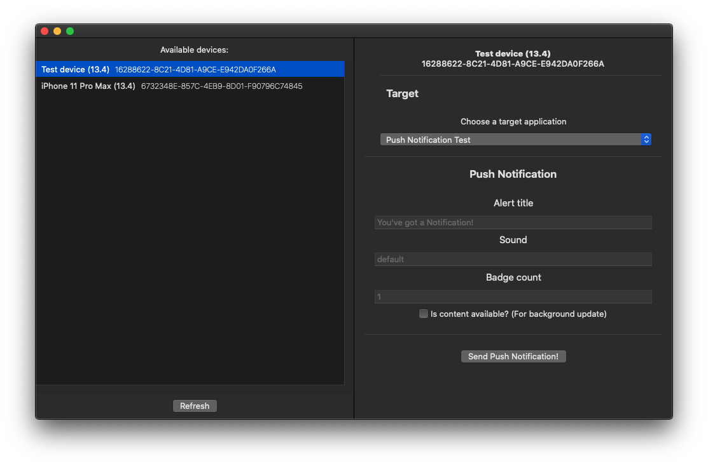

# Push Notification GUI
> GUI for iOS Simulator Push Notifications

Since iOS 13.4 Beta, Apple allowed Developers to test push notifications on simulators. This macOS application gives an easy to use GUI to send test notifications to any currently booted iOS simulator.

## About the application

The application was written in Swift, using SwiftUI.

It supports sending simple string as *alert*, using *sound* if one is defined in the target application and any *badge* count number. If you enable *contentAvailable*, the target application will be awaken for 30 seconds, like in real life cases.

More about the APNs [here](https://developer.apple.com/library/archive/documentation/NetworkingInternet/Conceptual/RemoteNotificationsPG/APNSOverview.html) or if you are only interested in the APNs Key Reference [here](https://developer.apple.com/library/archive/documentation/NetworkingInternet/Conceptual/RemoteNotificationsPG/PayloadKeyReference.html#//apple_ref/doc/uid/TP40008194-CH17-SW1).

## Release History

* 1.0
    * First release

## Meta

Hina Kormoczi – [@HinaKormoczi](https://twitter.com/HinaKormoczi) –  hina.kormoczi@icloud.com

Distributed under the GPL-3.0 license. See ``LICENSE`` for more information.

## Contributing

1. Fork it (<https://github.com/HinaKormoczi/PushNotificationGUI>)
2. Create your feature branch (`git checkout -b feature/fooBar`)
3. Commit your changes (`git commit -am 'Add some fooBar'`)
4. Push to the branch (`git push origin feature/fooBar`)
5. Create a new Pull Request
